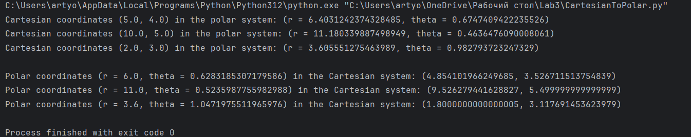
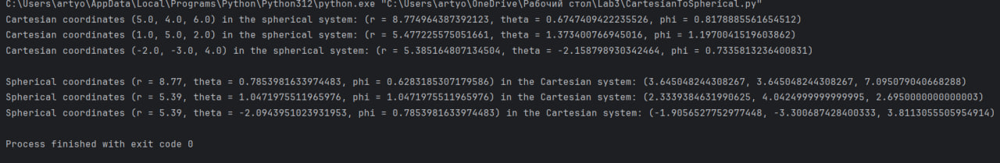
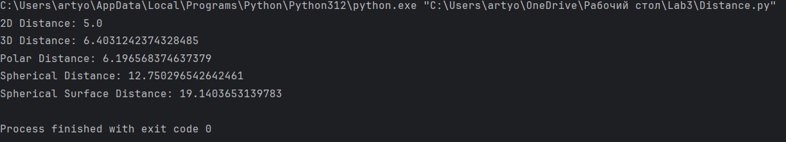
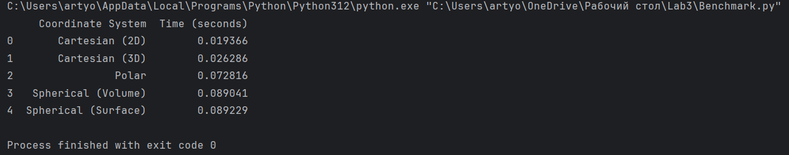

# LB3_CoordinateSystems
Лабораторная работа №3 "Реализация преобразований между системами координат"
Для примера был создан массив для трех точек.

Первое задание: В функции main() сначала конвертируются декартовы координаты (x, y) в полярные (r, θ) и выводятся результаты. Затем полярные координаты (r, θ) преобразуются обратно в декартовы (x, y) и также выводятся результаты.

Второе задание: Сначала декартовы координаты трех точек преобразуются в сферические координаты и выводится результат. Затем сферические координаты трех точек преобразуются обратно в декартовы и также выводятся результаты. Для преобразования используются стандартные математические формулы для перехода между этими системами координат.

После преобразования из полярной системы в декартову и из сферической системы в декартову, а затем обратно, координаты имели некоторую погрешность. Это связано с использованием числа π (pi) из библиотеки math в Python.

Функции distance_2d и distance_3d вычисляют евклидово расстояние между двумя точками в 2D и 3D соответственно. Функция polar_distance определяет расстояние между двумя точками в полярных координатах, а spherical_distance вычисляет расстояние между точками в сферических координатах. spherical_surface_distance рассчитывает расстояние по поверхности сферы между двумя точками на её поверхности.

Код генерирует случайные точки в декартовых, полярных и сферических координатах, вычисляет расстояния между точками в каждой системе координат и измеряет время выполнения этих вычислений. На диаграммах можно увидеть, что декартова двумерная система быстрее всех, это обусловлено тем, что для вычисления используется только две точки и простые расчеты, в отличие от полярной и сферической системы, в которых используются тригонометрические формулы.

Вычисления были проведены как в двумерном, так и в трехмерном пространстве для декартовой системы координат, а также по объему и по поверхности сферы для сферической системы координат.

Ознакомление с различными системами координат (декартовой, полярной и сферической) позволяет понять их особенности и применение. Бенчмаркинг вычислений расстояний показал, что декартовы координаты имеют наивысшую эффективность, тогда как полярные координаты демонстрируют схожую эффективность с 2D-декартовыми. Сферические координаты являются более затратными по времени из-за сложности вычислений. Это подтверждает важность выбора соответствующей системы координат в зависимости от задачи.